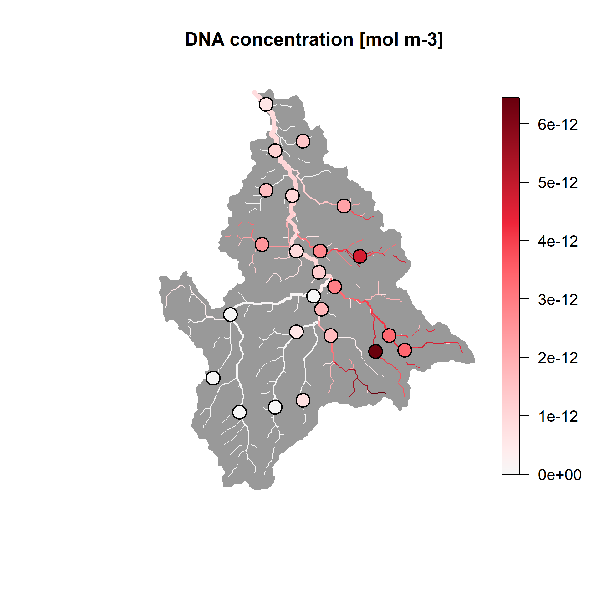

```{r setup, include = FALSE}
knitr::opts_chunk$set(
  collapse = TRUE,
  comment = "#>"
)
``` 

# Overview

`eDITH` (**eD**NA **I**ntegrating **T**ransport and **H**ydrology) allows spatially explicit interpretation and prediction of environmental DNA (eDNA) data collected from river networks. It implements the eDITH model, which couples a geomorphological and hydrological characterization of a catchment, eDNA transport and decay dynamics, and a species distribution model, to transform pointwise water eDNA data (sensu [@pawlowski2020]) collected at a catchment into space-filling predicted maps of taxon density. 

Features:

* It provides estimations of detection probability of any number of taxa across a whole catchment based on spatially replicated eDNA data of these taxa.
* It can handle both DNA concentration data (e.g., from qPCR) and metabarcoding (read counts) data of any taxonomic group, and can be used to predict space-filling maps of density of taxa (say, at species, genus or family level), OTUs (Operational Taxonomic Units) or ASVs (Amplicon Sequence Variants).
* Model fit can be performed via Bayesian techniques or optimization algorithms.
* Covariates can be specified by the user and/or selected by means of Asymmetric Eigenvector Maps (AEMs).
* An interface to the `DHARMa` package for residual diagnostics is provided.

`eDITH` requires the use of river networks defined as `river` objects, which can be built via the `rivnet` package.

# Installing the package

`eDITH` can be installed from CRAN:

```{r, eval=FALSE}
install.packages("eDITH")
```

The development version can be installed from Github:

```{r, eval=FALSE}
devtools::install_github("lucarraro/eDITH")
```

Among other packages, `eDITH` depends on `rivnet`, which in turn depends on the `traudem` package. `traudem` relies on the [TauDEM](https://hydrology.usu.edu/taudem/taudem5/) library. `traudem` provides a guide to correct installation of TauDEM and its dependencies for different operating systems, and offers wrapper commands to call TauDEM methods from R. Please read the `traudem` [documentation](https://lucarraro.github.io/traudem/) carefully.

# The eDITH model in a nutshell

## Overview and underlying assumptions

The eDITH model [@carraro2018; @Carraro2020; @Carraro2021; @Carraro2023] makes use of spatially replicated eDNA measurements within a river network to infer the spatial distribution of any taxon (or OTU, or ASV; hereafter simply "taxon") of interest across that river network. The key underlying concept is that eDNA particles are advected downstream by streamflow, and hence an eDNA sample is not only representative of the location where it is taken, but it provides information about taxon abundance (in the case of qPCR single-species data) or biodiversity (for metabarcoding data) for a certain area upstream of the sampling location. By exploiting information from multiple sampling sites distributed in space, and embedding a model for transport and concurrent decay of DNA, the eDITH model is able to disentangle the various sources of DNA shedding (and hence, of the target taxon's abundance). As a result, eDITH complements pointwise eDNA measurements by projecting taxon distributions (and thus biodiversity information) into space-filling catchment maps.

### DNA production and decay rates
The DNA production (i.e., shedding) rate of a taxon in stream water is assumed to be proportional to its density^[In particular, it is assumed that taxon density is equivalent to both biomass and abundance. Although shedding rates have been shown to scale allometrically with organismal mass [@yates2020], the distinction between biomass and abundance is, for modelling purposes, irrelevant. In essence, the patterns modelled by eDITH are those of a quantity that is proportional to the DNA production rate--be it biomass, abundance or allometrically scaled mass.] [@lodge2012; @apotheloz2017]. The validity of this assumption is restricted to the time point when eDNA is sampled. Thus, it is irrelevant if a taxon varies in its release of DNA across the season, as long as DNA released is proportionate to taxon density at the time of sampling). For the same reason, hydrological variables (such as discharge and velocity) are assumed to be constant in time (not in space!) across the duration of a sampling campaign. For instance, if multiple days are required to perform eDNA sampling across all sampling sites, these days would be assumed to constitute a unique time point, during which hydrological conditions can be adequately represented by time-averaged values of discharge and velocity.

The decay of DNA is assumed to be expressed by first order kinetics (i.e., the rate of change of DNA concentration decreases linearly with time). Similarly to the production rate, it is assumed that a single value of decay time is representative for a given taxon at a given time point.

### Sampling design
The spatial extent of the eDNA sampling must adequately cover the entire river network, in order to allow the model to make robust predictions. As a rule of thumb, there should be one sampling site per each 10--20 km^2^ of drained area.

Moreover, all main tributaries of a river network should be sampled in a spatially hierarchical design. Ideally, sampling sites should be located just upstream of a confluence, so that the independent signals from the joining tributaries can be gauged. See [@Carraro2021] for further information on optimal eDNA sampling strategies.

The mean distance (along the river network) between eDNA samples should not be too large, otherwise the eDNA found at an upstream site would be totally depleted before reaching the next downstream site. In this case, the eDITH model could not make inferences based on these multiple sites. To make an example, if we consider first order kinetics, a water velocity of 1 ms^-1^ and a decay time of 4 h (i.e., an half life of 2.77 h), we would be able to measure only about 50\% of the concentration that we would measure 10 km upstream, and 3\% of the concentration that we would measure 50 km upstream^[This estimate considers a channel with no lateral inputs. If lateral inputs with water not containing the target eDNA were considered, these percentages would inevitably decrease]. As a rule of thumb, sites that are more than 50 km apart (along the river network) should be considered as independent samples. See also [@Deiner2014; @Pont2018] with respect to transport distances of eDNA.

Finally, the model assumes that eDNA is well mixed in the water column, and/or that samples at a site adequately span the river cross section (e.g., sampling at both banks and at the centre, for large rivers, while in small rivers sampling at a single bank might be sufficient, by assuming that eDNA is sufficiently well mixed). Analogous care should be taken in the choice of a representative sampling volume to be filtered [@altermatt2023].  
  
### Measurement errors
Variability in DNA detection through sampling (e.g., filtration) or laboratory procedures (e.g. DNA extraction, Polymerase Chain Reaction (PCR), or sequencing) do not introduce a systematic bias in DNA concentrations across samples. 

If eDITH is used to model metabarcoding data, the expected read count at a given site for a given taxon is assumed to be proportional to the underlying DNA concentration.

Replicated eDNA measures at the same site and time point are treated as independent measures. No distinctions is made on whether these are physical (i.e., different water samples) or laboratory (different PCR runs) replicates.


### What taxa can be modelled?
In principle, the eDITH model is suitable for aquatic macroorganisms that shed their DNA into stream water. Nonetheless, the model can also be extended for microorganisms that are sampled in their entirety (e.g., free floating bacteria), in which case their upstream sources can be considered as biofilm colonies, and the decay time does not refer to DNA molecules but rather to the bacteria lifetime.

The eDITH model does not make a distinction on whether the eDNA data is referred to an assigned taxon (say, at a species, genus or family level) or an unassigned cluster such as OTUs or ASVs. What matters is that the assumptions on production and decay rates (see [DNA production and decay rates](#dna-production-and-decay-rates)) must hold.

In principle, it is also possible to estimate the spatial distribution of terrestrial, rather than aquatic, taxa, provided that the assumption of proportionality between DNA production rate and taxon density holds. In this case, the spatial unit on which predictions are performed is the subcatchment, i.e., the portion of land that directly drains towards the associated reach.  


### River network model
The domain on which the eDITH model is applied is a river network discretized into reaches, i.e. segments of river not interrupted by confluences and treated as smallest spatial units. Each reach is considered as a node of the network, and the ensemble of the reaches covers the entire river network. It is assumed that reaches have no internal variability (e.g., the exact coordinates of a sampling site do not matter, provided that the sampling site is associated to the same reach). Note that the along-stream distance between two consecutive confluences can be covered by a sequence of different reaches, to allow for a finer discretization of the river network. Indeed, number and maximum length of reaches can be tuned by using function `aggregate_river` of `rivnet`. See also [@Carraro2020OCN] and the documentation of the `OCNet` package for details on aggregation of a river network into reaches.

### Lakes and braided channels
The eDITH model is designed to work for river networks not containing lakes or reservoirs. Dynamics of eDNA in lakes are still largely unclear, but the very large residence times of water particles in lakes compared to those of a river reach imply that all dissolved DNA entering a lake either degrades or is retained by substrate particles. Particle-bound DNA can eventually be resuspended [@Shogren2017], but this likely occurs at long time scales (say, monthly, yearly or even longer), hence the assumption of first-order decay kinetics with a single decay time value across the river network (see below) would be violated.
 Similarly, the river networks produced by `rivnet` do not admit bifurcations in the downstream direction (e.g., braided or artificial channels creating loops in the river network). Hence, the different braids or channels cannot be treated as independent reaches in the eDITH model. In such a case, the eDITH model could still be applied by considering a single channel as a conceptual equivalent of the multiple real braids or channels. 

## The governing equations

The main equation of the eDITH model results from a mass balance of eDNA across a cross-section of a river, and it reads:

\begin{equation}
C_j = \frac{1}{Q_j}\sum_{i \in \gamma(j)} p_i A_{S,i} \exp\left(-\frac{L_{ij}}{\overline{v_{ij}} \tau}\right)
\end{equation}

where:

* $C_j$ is the DNA concentration at a sampling site $j$ (strictly speaking, $j$ is the reach where a sampling site is located);
* $Q_j$ is the water discharge in $j$; 
* $\gamma(j)$ identifies the set of reaches upstream of $j$;
* $p_i$ is the DNA production rate at an upstream reach $i$;
* $A_{S,i}$ is the source area in $i$ (i.e., extent of the node; considering a river reach and an aquatic taxon, this could e.g. be equal by the product of its length and width);
* $L_{ij}$ is the length of the along-stream path joining $i$ to $j$;
* $\overline{v_{ij}}$ is the average water velocity along $L_{ij}$;
* $\tau$ is a characteristic decay time for DNA in stream water.

Assuming that the morphology and hydrology of the river network are known (and thus lengths, areas and discharges), the above equation links DNA concentrations to the unknown parameters $\tau$ and $\mathbf{p}=\left( p_1, \dots, p_N\right)$ (where $N$ is the total number of reaches). While the former is linked to the behaviour of DNA in stream water (and could in principle be measured, or at least its value be constrained), the estimation of the latter is the actual goal of the eDITH model. Contrasting observed and modelled DNA concentrations thus enables the estimation of maps of $\mathbf{p}$ across all $N$ reaches constituting the river network, and hence of relative taxon density, given the initial assumption.

It is often convenient (both from a modelling and interpretation viewpoint) to express the DNA production rate $p_i$ as a function of environmental covariates, possibly related to the spatial patterns of the investigated taxon:

\begin{equation}
p_i = p_0 \exp\left( \boldsymbol\beta^T \mathbf{X}(i) \right)
\end{equation}

where $\mathbf{X}(i)$ is a vector of covariates evaluated at reach $i$; $\boldsymbol\beta$ a vector of covariate effect sizes; and $p_0$ a baseline production rate, i.e., the DNA production rate at a site where all covariates are at a null level. This reduces the number of unknowns from $N$ (size of $\mathbf{p}$) to the number of selected covariates (length of $\boldsymbol\beta$) plus one ($p_0$).

If the eDNA data are in the form of read counts, the above equations remain applicable. Indeed, $C_j$ would play the role of the expected read number at site $j$ (proportional to the underlying DNA concentration, as per the initial hypothesis). Consequently, $\mathbf{p}$ would in this case represent the DNA production rates multiplied by such constant of proportionality.

## Estimating detection probability

Once model parameters are estimated (either via a Bayesian method or likelihood maximization), it is possible to transform DNA production rates $\mathbf{p}$ into corresponding detection probabilities. This is done by exploiting the assumption on the probability distribution used to model measurement errors (and hence formulate the likelihood, see [Likelihood function and model parameters](#likelihood-function-and-model-parameters)).

In particular, this is done by calculating, for each reach $j$, the expected eDNA value $\widetilde{C_j}$ (concentration or read count) if that reach were detached from the river network (that is, in the absence of upstream inputs, with the water discharge in the reach being equal to the locally produced discharge^[Calculated as the actual discharge $Q_j$ minus the sum of discharges of the upstream reaches that are directly connected to $j$]). This is then transformed into a detection probability value, calculated as the probability of observing a non-null eDNA value under the assumed error probability distribution and the expected value $\widetilde{C_j}$.

The so-obtained detection probability maps can be further transformed into presence-absence maps and used to assess biodiversity patterns [e.g., @Carraro2023].

# Required data

eDNA data must be provided in the `data` field of `run_eDITH_BT` and `run_eDITH_optim` as a data frame with components `values` (eDNA values measured for a given taxon and a given time point) and `ID` (identifiers of the network nodes (i.e., reaches) at the AG level^[Please refer to the documentation of `OCNet` for an overview of the aggregation levels of a `river` object.] where the sampling sites are located). To identify the latter, function `locate_site` from `rivnet` can be used. 

The river network must be provided as a `river` object, obtained via the `rivnet` package. It is fundamental that the river be aggregated into reaches (via `aggregate_river`) and that it contains hydrological data, such that discharges and water velocities can be used as input in the eDITH model. This can be obtained via the `hydro_river` function of `rivnet`. In its simplest setting, a single value of discharge (or depth) and width, not necessarily at the same reach, are required in order to extrapolate hydraulic variables across the whole network. The exact method with which hydrological variables are extrapolated to the river network depends on the number and type of data provided; please refer to the documentation of `hydro_river` for further details.

Optionally, covariates can be passed to `run_eDITH_BT` and `run_eDITH_optim` as a data frame. Function `covariate_river` of `rivnet` allows computing covariate values from raster maps and a `river` object. If covariates are not provided, asymmetric eigenvector maps (AEMs) are calculated on the river network and used as covariates. AEMs [@blanchet2008] are mutually orthogonal spatial variables obtained by a spatial filtering technique that considers space in an asymmetric way, and are thus suitable to model species distributions in river networks. It is of course possible to combine user-provided covariates and AEMs, as detailed in the flowchart below:

```{r overview, echo=FALSE, fig.cap="Flowchart for the choice of covariates used to fit the eDITH model.", out.width = '90%'}
knitr::include_graphics("flowchart_cov.png")

```


# Likelihood function and model parameters

By default, `eDITH` implements four probability distributions to model errors between observed and modelled data: 

* the normal (`ll.type = "norm"`) and log-normal (`ll.type = "lnorm"`) distributions are suitable to model *DNA concentration* data. 
* the geometric (`ll.type = "geom"`) and negative binomial (`ll.type = "nbinom"`) distributions are suitable for *read count* data. 

**Note that the user is expected to set option `ll.type` according to the nature of the `data` provided in `run_eDITH_BT` or `run_eDITH_optim`.** 

Moreover, the optional argument `no.det = TRUE` can be used to produce a zero-inflated error distribution. This is mandatory if `ll.type = "lnorm"`, as the log-normal distribution does not admit zeros.

Default model parameters are as follows:

* `tau` represents decay time $\tau$ in hours.
* `log_p0` is the logarithm in base 10 of the baseline production rate $p_0$. The units of $p_0$ are equal to the units of the inputted `data$values` multiplied by a length unit and divided by a time unit. For instance, if `data$values` contains DNA concentration data in mol m^-3^ and the river object contains discharge (`river$AG$Q`) in m^3^s^-1^ and areas^[This depends on the resolution of the DEM used to obtain the river network in `rivnet::extract_river`.] in m^2^, $p_0$ is expressed in mol m^-2^ s^-1^ (i.e. amount of DNA shed per unit area and unit time). In the case of read count data, the unit for $p_0$ might look weird; this is because, in this case, $p_0$ embeds a constant that transforms expected DNA concentration predicted by the model into expected read number.
* `beta_X` is the effect size of covariate `X`, where `X` is replaced by the object names in the `covariates` data frame (if provided), and/or by e.g. `AEM1` when AEM eigenfunctions are used. In this case, the number indicates the corresponding eigenfunction.

Additional parameters can be added depending on the likelihood definition:

* `sigma` is the standard deviation of the error (when `ll.type = "norm"` or `"lnorm"`). Note that, if a log-normal distribution is used, `sigma` is the standard deviation of the non-log-transformed values (and is hence different than parameter `sdlog` of `dlnorm`).
* `omega` is the overdispersion parameter (when `ll.type = "nbinom"`), which is defined as the ratio between variance and mean [@linden2011].
* no additional error parameter is present if `ll.type = "geom"`.
* `Cstar` is a further parameter added when the optional argument `no.det = TRUE` is passed. In this case, the probability of non-detection is expressed as `exp(-C/Cstar)`, where `C` is the modelled eDNA value (expected concentration or read number) at a given site. Increased `Cstar` increases the non-detection probability, all else being equal. See @carraro2018 for details. 

# A minimal example

## Generating a `river` object

To illustrate the functioning of `eDITH`, let's run an example in the river Wigger (Switzerland), whose `river` object can be called via `data(wigger)`.
Such an object can be built via the `rivnet` package as follows. Please refer to `rivnet` documentation for details on its functions.

```{r, eval=FALSE}
# Extract river from DEM
river <- rivnet::extract_river(outlet=c(637478,237413),
                    EPSG=21781, #CH1903/LV03 coordinate system
                    ext=c(6.2e5,6.6e5,2e5,2.5e5),
                    z=9)

# Aggregate river - default thrA and maxReachLength = 2500 m
river <- rivnet::aggregate_river(river, maxReachLength = 2500)

# Hydraulic data: width = 8 m, discharge = 15 m3/s at the outlet
hydrodata <- data.frame(data = c(8, 15), 
                        type = c("w", "Q"), 
                        node = river$AG$outlet*c(1, 1))

# Assign hydraulic variables across the river network
river <- rivnet::hydro_river(hydrodata, river)

# Attribute landcover classes as covariates
r1 <- terra::rast(system.file("extdata/landcover.tif", 
                       package = "rivnet"))
river <- rivnet::covariate_river(r1, river)

```

## Preparing and displaying eDNA data

An example of DNA concentration data for a given target taxon can be called as:
```{r, eval=FALSE}
data(dataC)
```
`dataC` contains the following objects:

* `ID`: identifiers of river network nodes at the AG levels where eDNA has been sampled (these can be retrieved via `rivnet::locate_site` based on the site coordinates).
* `values`: corresponding values of DNA concentration measured (in mol m^-3^)

`dataC` contains eDNA values for 24 sampling sites, each of which has been sampled three times. In such case, the three different eDNA values are inserted in `dataC` as independent rows:

```{r, eval=FALSE}
dataC[which(dataC$ID==2),]
#>    ID       values
#> 1   2 0.000000e+00
#> 25  2 1.037331e-12
#> 49  2 8.176798e-13
```

We can use function `rivnet::points_colorscale` to display the mean DNA concentration values across the sampling sites:

```{r, eval=FALSE}
sites <- unique(dataC$ID)
values <- numeric(length(sites))
for (ind in 1:length(sites)){
  s <- sites[ind]
  values[ind] <- mean(dataC$values[dataC$ID==s])
}

plot(river)
rivnet::points_colorscale(river$AG$X[unique(dataC$ID)], river$AG$Y[unique(dataC$ID)],
                          values)
title("Mean observed DNA concentration [mol m-3]")

```

```{r map2, echo=FALSE, out.width = '80%'}
knitr::include_graphics("map2.png")

```

## Running the eDITH model

We can define a set of covariates containing main landcover classes (urban areas, agricultural areas and forest) in addition to elevation and log-scaled drainage area:

```{r, eval=FALSE}
covariates <- data.frame(urban = river$SC$locCov$landcover_1,
                         agriculture = river$SC$locCov$landcover_2,
                         forest = river$SC$locCov$landcover_3,
                         elev = river$AG$Z,
                         log_drainageArea = log(river$AG$A))

```

### Bayesian methods

We can use a Bayesian approach to fit the eDITH model. Function `run_eDITH_BT` interfaces with the `BayesianTools` package, which contains several different Bayesian samplers. The default choice in `run_eDITH_BT` is DREAMzs [@Carraro2023]. We can run eDITH with the above-specified covariates:

```{r, eval=FALSE}
set.seed(1)
out.bt.cov <- run_eDITH_BT(dataC, river, covariates)

```

The default option for `ll.type` is `norm`, which is suitable for DNA concentration data.

Alternatively, we can run eDITH via AEM covariates. By default, the first 10\% AEM eigenfunctions are used as covariates.

```{r, eval=FALSE}
set.seed(1)
out.bt.aem <- run_eDITH_BT(dataC, river)

```


### Optimization

Alternatively, an optimization method can be used to estimate the best-fit parameters of the eDITH model. Function `run_eDITH_optim` internally calls `optim` and its default Nelder-Mead method. The main options such as `covariates` and `ll.type` work in the same way as in `run_eDITH_BT`:

```{r, eval=FALSE}
set.seed(27)
out.opt.aem <- run_eDITH_optim(dataC, river, n.AEM = 10, 
	n.attempts = 1) 
```

For illustrative purposes, we here use a reduced number of AEM eigenfunctions (10) and a single optimization attempt. It is advisable to increase the number of optimization attempts (as in the default settings) to ensure convergence.

We can qualitatively check the goodness of fit of the model:
```{r, eval=FALSE}
plot(out.opt.aem$C[dataC$ID], dataC$values, 
     xlim=c(0,8e-12), ylim=c(0, 8e-12), asp=1,
     xlab = "Modelled concentration [mol m-3]", 
     ylab = "Observed concentration [mol m-3]")
abline(0,1)
```

```{r Cobs, echo=FALSE, out.width = '80%'}
knitr::include_graphics("Cobs.png")

```

And also display modelled concentrations across the river network, by using `rivnet`'s `plot` method:
```{r, eval=FALSE}
plot(river, out.opt.aem$C, colLevels=c(0, max(values), 1000), addLegend = FALSE, 
     colPalette = hcl.colors(1000, "Reds 3", rev=T))
rivnet::points_colorscale(river$AG$X[unique(dataC$ID)], river$AG$Y[unique(dataC$ID)],
                          values)
title("DNA concentration [mol m-3]")
```

```{r mapC, echo=FALSE, out.width = '80%'}


```

Finally, we can have a look at the predicted map of relative taxon density (i.e., DNA production rate $\mathbf{p}$)
```{r, eval=FALSE}
plot(river, out.opt.aem$p)
title('DNA production rate [mol m-2 s-1]')
```

```{r mapp, echo=FALSE, out.width = '80%'}
knitr::include_graphics("mapp.png")

```

And the corresponding detection probability $\mathbf{p_D}$:
```{r, eval=FALSE}
plot(river, out.opt.aem$probDet)
title('Detection probability')
```

```{r mappD, echo=FALSE, out.width = '80%'}
knitr::include_graphics("mappD.png")

```

# References

---
references:

- id: altermatt2023
  title: Quantifying biodiversity using eDNA from water bodies. General principles and recommendations for sampling designs
  author:
  - family: Altermatt
    given: F.
  - family: Carraro
    given: L. 
  - family: Antonetti
    given: M. 
  - family: Albouy
    given: C. 
  - family: Zhang
    given: Y.  
  - family: Lyet
    given: A.
  - family: Zhang
    given: X. 
  - family: Pellissier
    given: L. 
  container-title: Environmental DNA
  URL: 'https://doi.org/10.1002/edn3.430'
  type: article-journal
  issued:
    year: 2023

- id: apotheloz2017
  title: Taxonomy-free molecular diatom index for high-throughput eDNA biomonitoring
  author:
  - family: Apothéloz-Perret-Gentil
    given: L.
  - family: Cordonier
    given: A. 
  - family: Straub
    given: F. 
  - family: Iseli
    given: J. 
  - family: Pawlowski
    given: J. 
  container-title: Molecular Ecology Resources
  URL: 'https://doi.org/10.1111/1755-0998.12668'
  type: article-journal
  issued:
    year: 2017
    
- id: blanchet2008
  title: Modelling directional spatial processes in ecological data
  author:
  - family: Blanchet
    given: F. G.
  - family: Legendre
    given: P.
  - family: Borcard
    given: D.
  container-title: Ecological Modelling
  URL: 'https://doi.org/10.1016/j.ecolmodel.2008.04.001'
  type: article-journal
  issued:
    year: 2008

- id: carraro2018
  title: Estimating species distribution and abundance in river networks using environmental DNA
  author:
  - family: Carraro
    given: L.
  - family: Hartikainen
    given: H.
  - family: Jokela
    given: J.
  - family: Bertuzzo
    given: E.
  - family: Rinaldo
    given: A.
  container-title: Proceedings of the National Academy of Sciences of the United States of America
  URL: 'https://doi.org/10.1073/pnas.1813843115'
  type: article-journal
  issued:
    year: 2018
    
- id: Carraro2020OCN
  title: Generation and application of river network analogues for use in ecology and evolution
  author:
  - family: Carraro
    given: L.
  - family: Bertuzzo
    given: E.
  - family: Fronhofer
    given: E. A.
  - family: Furrer
    given: R.  
  - family: Gounand
    given: I.
  - family: Rinaldo
    given: A. 
  - family: Altermatt
    given: F.
  container-title: Ecology and Evolution
  URL: 'https://doi.org/10.1002/ece3.6479'
  type: article-journal
  issued:
    year: 2020

- id: Carraro2020
  title: Environmental DNA allows upscaling spatial patterns of biodiversity in freshwater ecosystems
  author:
  - family: Carraro
    given: L.
  - family: Mächler
    given: E.
  - family: Wüthrich
    given: R.  
  - family: Altermatt
    given: F.
  container-title: Nature Communications
  URL: 'https://doi.org/10.1038/s41467-020-17337-8'
  type: article-journal
  issued:
    year: 2020

- id: Carraro2021
  title: How to design optimal eDNA sampling strategies for biomonitoring in river networks
  author:
  - family: Carraro
    given: L.
  - family: Stauffer
    given: J. B.
  - family: Altermatt
    given: F.
  container-title: Environmental DNA
  URL: 'https://doi.org/10.1002/edn3.137'
  type: article-journal
  issued:
    year: 2021

- id: Carraro2023
  title: Modelling environmental DNA transport in rivers reveals highly resolved spatio-temporal biodiversity patterns
  author:
  - family: Carraro
    given: L.
  - family: Blackman
    given: R. C.
  - family: Altermatt
    given: F.
  container-title: Scientific Reports
  URL: 'https://doi.org/10.1038/s41598-023-35614-6'
  type: article-journal
  issued:
    year: 2023
    
- id: Deiner2014
  title: Transport Distance of Invertebrate Environmental DNA in a Natural River
  author: 
  - family: Deiner
    given: K.
  - family: Altermatt
    given: F.
  container-title: PLOS ONE
  URL: 'https://doi.org/10.1371/journal.pone.0088786'
  type: article-journal
  issued:
    year: 2014
  

- id: linden2011
  title: Using the negative binomial distribution to model overdispersion in ecological count data
  author:
  - family: Lindén
    given: A.
  - family: Mäntyniemi
    given: S.
  container-title: Ecology
  URL: 'https://doi.org/10.1890/10-1831.1'
  type: article-journal
  issued:
    year: 2011
    
- id: lodge2012
  title: Conservation in a cup of water. Estimating biodiversity and population abundance from environmental DNA
  author:
  - family: Lodge
    given: D. M.
  - family: Turner
    given: C. R.
  - family: Jerde
    given: C. L.
  - family: Barnes
    given: M. A.
  - family: Chadderton
    given: L.
  - family: Egan
    given: S. P.
  - family: Feder
    given: J. L.
  - family: Mahon
    given: A. R.
  - family: Pfrender
    given: M. E.
  container-title: Molecular Ecology
  URL: 'https://doi.org/10.1111/j.1365-294X.2012.05600.x'
  type: article-journal
  issued:
    year: 2012   
    
- id: pawlowski2020
  title: Environmental DNA. What's behind the term? Clarifying the terminology and recommendations for its future use in biomonitoring
  author:
  - family: Pawlowski
    given: J.
  - family: Apothéloz-Perret-Gentil
    given: L.
  - family: Altermatt
    given: F.
  container-title: Molecular Ecology
  URL: 'https://doi.org/10.1111/mec.15643'
  type: article-journal
  issued:
    year: 2020 

- id: Pont2018
  title: Environmental DNA reveals quantitative patterns of fish biodiversity in large rivers despite its downstream transportation
  author:
  - family: Pont
    given: D.
  - family: Rocle
    given: M.
  - family: Valentini
    given: A.  
  - family: Civade
    given: R.
  - family: Pauline
    given: J. 
  - family: Maire
    given: A.  
  - family: Roset
    given: N.
  - family: Schabuss
    given: M. 
  - family: Zornig
    given: H. 
  - family: Dejean
    given: T. 
  container-title: Scientific Reports
  URL: 'https://doi.org/10.1038/s41598-018-28424-8'
  type: article-journal
  issued:
    year: 2018 
   
- id: Shogren2017
  title: Controls on eDNA movement in streams. Transport, Retention, and Resuspension
  author:
  - family: Shogren
    given: A. J.
  - family: Tank
    given: J. L.
  - family: Andruszkiewicz
    given: E.
  - family: Olds
    given: B.
  - family: Mahon
    given: A. R.
  - family: Jerde
    given: C. L.
  - family: Bolster
    given: D.  
  container-title: Scientific Reports
  URL: 'https://doi.org/10.1038/s41598-017-05223-1'
  type: article-journal
  issued:
    year: 2017    
    
- id: yates2020
  title: The relationship between eDNA particle concentration and organism abundance in nature is strengthened by allometric scaling
  author:
  - family: Yates
    given: M. C.
  - family: Glaser
    given: D. M.
  - family: Post
    given: J. R.
  - family: Cristescu
    given: M. E.
  - family: Fraser
    given: D. J.
  - family: Derry
    given: A. M.
  container-title: Molecular Ecology
  URL: 'https://doi.org/10.1111/mec.15543'
  type: article-journal
  issued:
    year: 2020 
    
--- 
   

